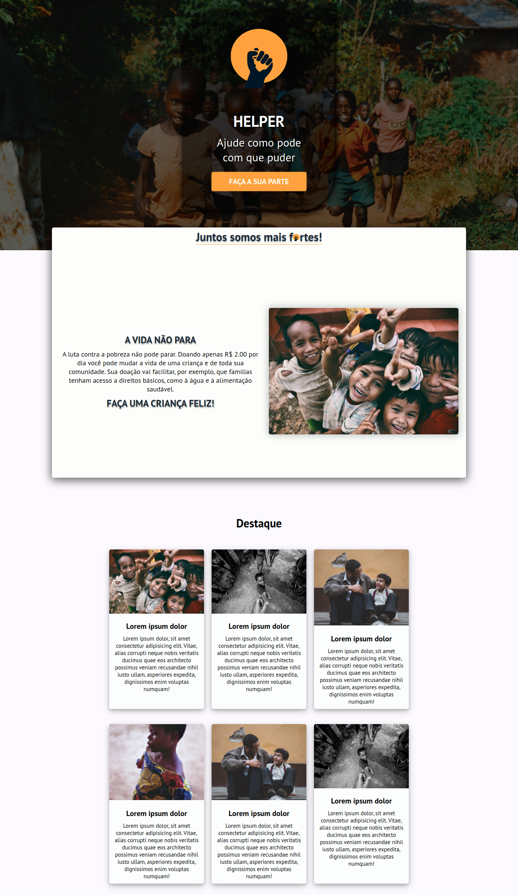
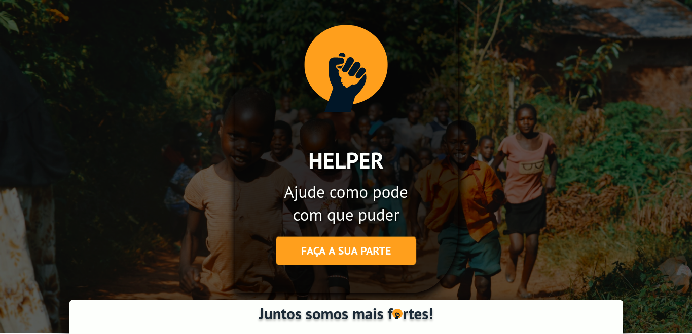
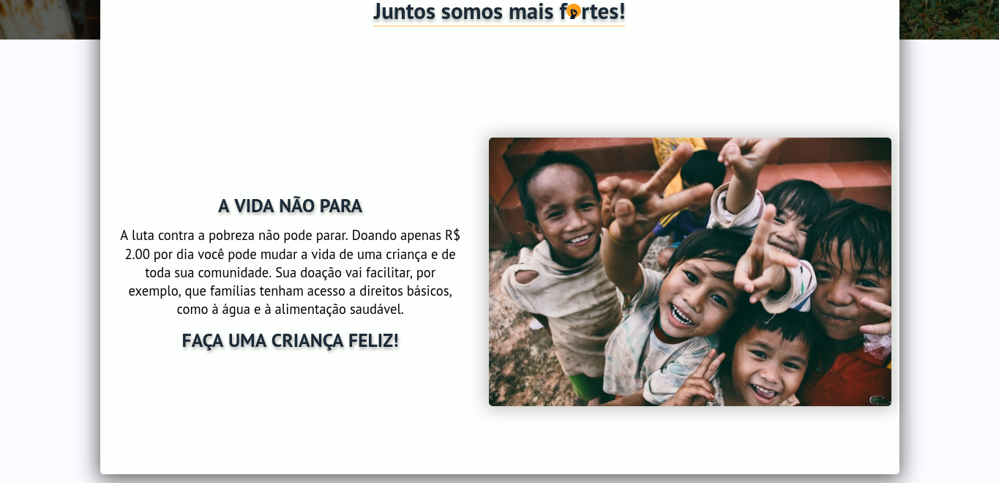
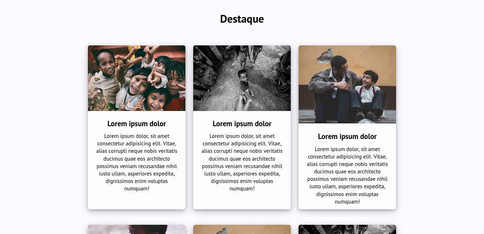

# Website-Helper :computer:

Uma landing page feita com objetivo de colocar em pratica os estudos.

## Principais objetivos do projeto :dart:
- CSS
- Entendimento de responsividade
- Estrutura de components
- Layout

[Veja o resultado - click aqui](https://react-helper.vercel.app/)

  
## Screenshots :camera_flash:

  

   
  
  

  
## Autor :vulcan_salute:

- [@FernandoCMF](https://github.com/FernandoCMF)

  
## Proximos estudos

- Otimizar carregamento da pagina
- Formulario
- Efeito hover
- display grid

### Vamos estudar juntos :rocket:

